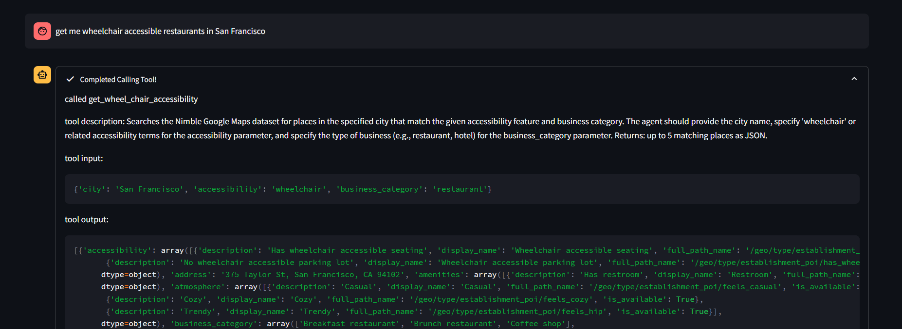
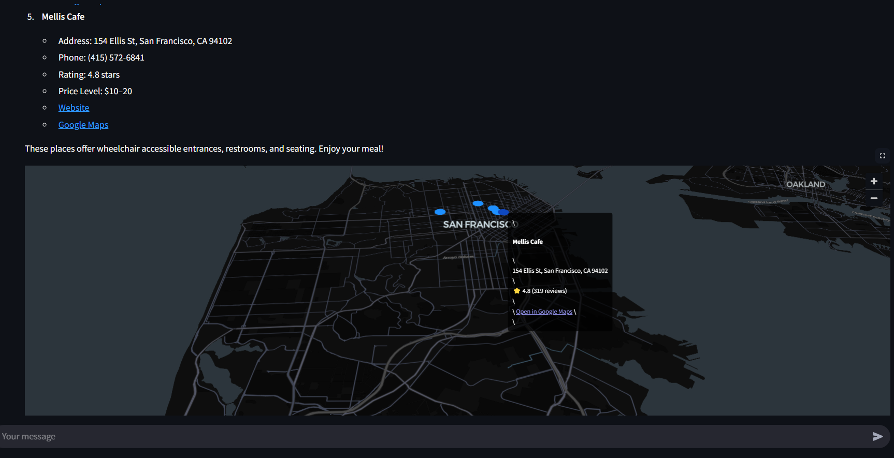

## AccessCity

Welcome to AccessCity! A project designed to make cities more accessible for everyone.

## Inspiration

Cities are filled with incredible places to explore, but for many people with disabilities, accessing these spaces can be difficult or even impossible. We were inspired to build AccessCity to help make everyday choices like where to eat or meet friends easier and more inclusive. By enabling users to search in natural language for places that meet their accessibility needs, we hope to make a small but meaningful impact on urban inclusion.

## What it does

AccessCity enables users to query accessibility-focused information about venues (restaurants, cafes, events, etc.) using natural language. For example:

> "Get me wheelchair accessible restaurants in San Francisco"

The app uses generative AI to interpret the user's intent and translate it into structured queries against a curated dataset of local businesses and amenities. It surfaces results tailored to a user's specific accessibility needs helping them save time and avoid uncertainty.

Following the above example, here is what the app will display after sending through the above query.

In the below screenshot we can see the agent provides full transparency into the tool called and the parameters used.

At the very end of the response, the app displays the location of the given resturant, cafe, etc. on the map by using the coordinates.

## How we built it

We used the following technologies and tools:

- **Streamlit running in Databricks Apps** for the frontend and user interaction
- **Spark SQL** to query accessibility metadata from a Delta Lake-backed dataset
- **LangGraph tools** for chaining model reasoning with function calling
- **Databricks Model Serving** to deploy LLM endpoints for inference
- **OpenAI APIs** as a fallback when local model performance was insufficient

## Challenges we ran into

- Various langchain abstractions that we used in the past did not work very well with a few of the models being served out of Databricks. For example, LangChains langchain_core.messages, specifically the [AIMessage](https://python.langchain.com/api_reference/core/messages/langchain_core.messages.ai.AIMessage.html) and the [HumanMessage](https://python.langchain.com/api_reference/core/messages/langchain_core.messages.human.HumanMessage.html). AIMessage and HumanMessage in LangChain provide structured, role-aware representations of conversation turns, enabling better memory management, multi-turn context retention, and seamless integration with chat models that expect role-based inputs. This structure simplifies building stateful, dynamic AI applications. This did not seem to work very well with Llama models and we had to revert to something we were more familiar with (ie: OpenAI)

## What we learned

- Leveraging things like [Unity Catalog Functions](https://learn.microsoft.com/en-us/azure/databricks/generative-ai/agent-framework/create-custom-tool) could of streamlined our function calling/tool calling work. If we exposed our functions in Unity Catalog we could of use the playground to generate the code to call these functions. Shout out to [Scott Mckean](https://www.linkedin.com/in/scotthmckean/) and [Chris Chalcraft](https://www.linkedin.com/in/cchalc/) for the tip! 

## What's next for AccessCity

- **Semantic search for categories**: enable more accurate searching of the business categories by comparing the user's query to the available options' embeddings.
- **User Feedback Loop**: Enable users to submit feedback about accessibility data quality or suggest updates.
- **Voice-first UX**: Integrate voice input for an even more accessible search experience.
- **Broader Data Coverage**: Expand to include public transport, cultural venues, and city infrastructure.
- **Mobile Optimization**: Wrap the app for mobile-first experiences using Streamlit sharing or PWA wrappers.
- **Integration with city APIs**: Pull live data from municipal accessibility and infrastructure APIs where available.

Made with ❤️ by a team that believes everyone should be able to explore their city freely.
